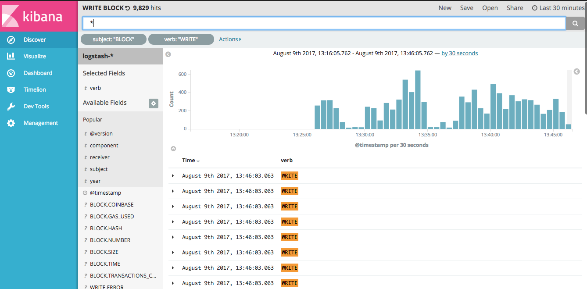

## Instructions

Install `filebeat`, `logstash`, `elasticsearch`, and `kibana`.
```
brew install filebeat logstash elasticsearch kibana
```

#### Geth
Turn geth on. The only required flag here is `--mlog`, and I'm using `=json`
because I've found it easier to move through logstash (don't have to `grok`
nearly as much).
> Terminal 1
```
geth --mlog=json --log-status="sync=10" --cache 100 --log-dir=~/LibraryEthereumClassic/mainnet/log --rpc --ws --ws-port=3000 --verbosity 6
```
:arrow_down:

#### Filebeat
Run from geth-ELK repo, eg., use this repo's logstash config file instead of the default config
file, or move/copy it to filebeat's config dir (`/usr/local/etc/filebeat`).
filebeat -e -c
> Terminal 2
```
echo $(pwd)
> ~/dev/geth-ELK
filebeat -e -c $(pwd)/filebeat.geth.mlog.json.yml -d "publish"
```
:arrow_down:

#### Logstash
Turn logstash on. Again, this should use _this repo's_ config file, not the default config.
You can either copy/rename this file to the default logstash config dir, or use
it relatively from the command.
> Terminal 3
```
logstash -f ls-pipeline-json.conf --config.reload.automatic
```
:arrow_down:

#### Elasticsearch
Turn elastic search on.
> Terminal 4
```
elasticsearch
```
:arrow_down:

#### Kibana
Turn kibana on.
> Terminal 5
```
kibana
```
:arrow_down:

Now you can open `localhost:5601` in the browser and find kibana.

You may need to use management->indexes to create indexes for `logstash-*`.


----


Reference documents for setting up ELK with geth's forthcoming `mlog`
implementation.

- Elasticsearch
- Logstash
- Kibana


[setup.sh](./setup.sh) is just pseudo-code. Don't try running it. Just
documenting the e-l-k pattern.

[kibana-save-searches-example.json](./kibana-save-searches-example.json) are
two Saved Search examples from Kibana made with the Kibana Export function.
You should be able to Import this file to setup the searches

- WRITE BLOCK
- SERVER ADD PEER




----

> etcstats.net
```
# not sure ws is required
geth --ws --ws-port=3000 --rpc

# go to the net stats thingey
cd dev/etc/net-stats-api-eth-whatever
npm install
env WS_SERVER=rpc.etcstats.net WS_SECRET=5ceuMix4qSM6APj7QwTPU npm start app.json
```

