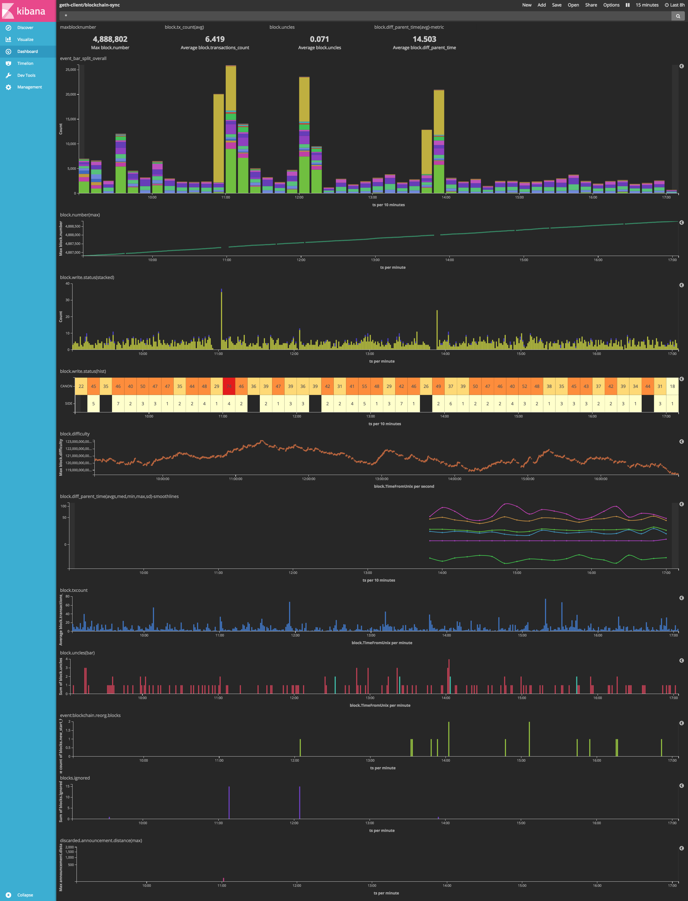

# Understanding geth with log analysis

> Please note that this document and the geth APIs referenced herein are still (as of 22 Nov 2017) in an experimental stage and should not be relied on for production purposes.

This is a walkthrough designed to help get you up and running using [Ethereum Classic](https://ethereumclassic.github.io/)'s
[geth](https://github.com/ethereumproject/go-ethereum) with the venerated [ Elasticsearch-Logstash-Kibana (_ELK_)](https://www.elastic.co/products) stack.

Below is an example of one of my geth dashboards built with the ELK tools. You can build one like this or branch out and design it however you want. The cool thing is that once you get a hang of building visualizations, you'll be able to chase down your own unique ideas and questions about the client and network.

There are, I'm sure, tons of tutorials out there on learning to work with Elasticsearch and build visualizations with Kibana, and I'm _very far_ from being an expert on the subject. So I'm going to focus more on describing and (hopefully) troubleshooting the geth and initial set up parts.



### Big picture

"Extract, Transform, Load" (_ETL_) is a phrase that gets thrown around. It means "organize some crazy shit to make it sensible, and so you can actually do stuff with it." The crazy shit we're going
to sensify comes from geth via the `mlog` feature. Geth's `mlog` stands for "machine logging" and it's a log system that's intended to produce logs that ETL systems can wrap their tiny little machine brains around.

Once we get geth's `mlog`s up and running, we're going to point __Filebeat__ at them to watch, read, and send off to __Logstash__. Once Logstash hears about some incoming logs from Filebeat, Logstash will parse and transform those raw logs into a structured data format for __Elasticsearch__. Elasticsearch then does a bunch of indexing and stuff and fires up a port to be able to talk to __Kibana__ about that data. Kibana is the application that provides a nice UI to interact with Elasticsearch data; build visualizations, make searches and filters... etc.

It's kind of a long ass pipeline, but the team at Elastic have done a great job of making modular software that, while it seems kind of long and complicated, offers a lot of flexibility because of the modularity; you can run Filebeat on one server next to your geth, then pipe those logs along to Logstash and Elasticsearch on another server (or two); separate your concerns, user privileges, and public APIs. Weird but great.

Be advised: we're going to run __each of these tools__ in their own terminal console. You're going to have 5 terminals open by the end of this. There are probably ways to use services, screens, backgrounding, etc. to keep your tab count smaller, but that's for another time.

### Install all the things

OSX:
```
$ brew install ethereumproject/classic/geth
$ brew install filebeat logstash elasticsearch kibana
```

If you're on Linux or Windows, you're on your own for the (F)ELK stack. You can install geth
by checking out our [Releases Page](https://github.com/ethereumproject/go-ethereum/releases) and just downloading the (archived) binary, un-archiving the executable, and moving it to your `$PATH`.


### Get geth going

##### Terminal 1

So far for geth `mlog` is disabled by default; you'll need to turn it on as you fire up your geth instance.

```
$ geth --mlog=json
```

In this walkthrough I'm only going to use the `json` format for mlogs. You can also use
`kv`, or `plain`. I like JSON because Logstash likes JSON, so it saves a lot of [`grok`ing](https://www.elastic.co/guide/en/logstash/current/plugins-filters-grok.html).

You can also use `--mlog-dir=place/for/mlogs [default: <datadir>/<chaindir>/mlogs]` to pick where you want to keep these logs. Be advised that these logs aren't tiny. Geth will generate about 200MB of machine logs every 12 hours. If you're only interested in mlogs for certain components, you can also use the `--mlog-components` flag. As usual, check out `geth help` for a little more information there.

#####  You get out what you put in.
Elasticsearch is going to ingest and store the data it gets from geth. This means that Elasticsearch
_will only have_ the data that you mlog from geth until you run it with mlog tomorrow... and so on. If you've only used `--mlog` with geth today, that's all the data Elasticsearch is going to get. It won't automatically have lifetime of data for your geth client or somehow magically know about the whole blockchain.


### Filebeat, Logstash, Elasticsearch

##### Terminal 2

> Filebeat config: [./filebeat.geth.mlog.json.yml](./filebeat.geth.mlog.json.yml)
```
filebeat.prospectors:
- input_type: log
  paths:
    - /Users/ia/Library/EthereumClassic/mainnet/mlogs/geth*
  symlinks: true
  json.message_key: event
  json.keys_under_root: true
output.logstash:
  hosts: ["localhost:5043"]
```

Note that we're using wildcard globbing to read all `mlog*` files. Geth will create a new mlog file each time it fires up, and automatically roll the log file when it reaches a max size. Your `mlogs/` may well end up looking like

```
-rw-r--r-- 1 ia staff 3.8M Nov 21 11:43 geth.mh.ia.mlog.20171121-114144.51125
-rw-r--r-- 1 ia staff  53M Nov 21 16:54 geth.mh.ia.mlog.20171121-114910.52716
-rw-r--r-- 1 ia staff  40M Nov 21 20:35 geth.mh.ia.mlog.20171121-165414.8245
-rw-r--r-- 1 ia staff 112M Nov 22 10:43 geth.mh.ia.mlog.20171121-223130.69466
-rw-r--r-- 1 ia staff 183M Nov 23 10:55 geth.mh.ia.mlog.20171122-213235.3464
-rw-r--r-- 1 ia staff 3.5M Nov 23 10:55 geth.mh.ia.mlog.20171123-105520.37157
-rw-r--r-- 1 ia staff 6.2M Nov 23 11:06 geth.mh.ia.mlog.20171123-105957.38013
-rw-r--r-- 1 ia staff  14M Nov 23 12:01 geth.mh.ia.mlog.20171123-110659.39536
-rw-r--r-- 1 ia staff  18M Nov 23 13:47 geth.mh.ia.mlog.20171123-120155.50707
-rw-r--r-- 1 ia staff 3.7M Nov 23 13:48 geth.mh.ia.mlog.20171123-134731.70141
-rw-r--r-- 1 ia staff  40M Nov 23 19:27 geth.mh.ia.mlog.20171123-135124.71278
```

so it's a nice feature for Filebeat to provide.

Turn Filebeat on:

```
$ filebeat -e -c $(pwd|echo path/to/this/dir)/filebeat.geth.mlog.json.yml -d "publish"
```

The point is you want to use _this_ config file. Filebeat's default config dir is /usr/local/etc/filebeat and it comes with a default config file, so you can either toss this config in there or point to it.

Filebeat is publishing your logs on port `5043`.


----

##### Terminal 3


