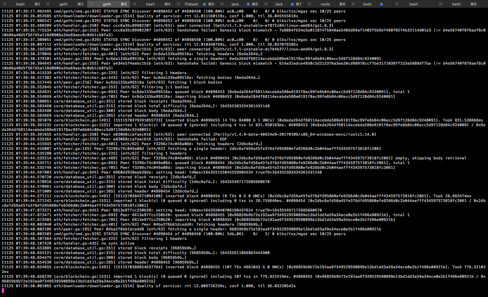
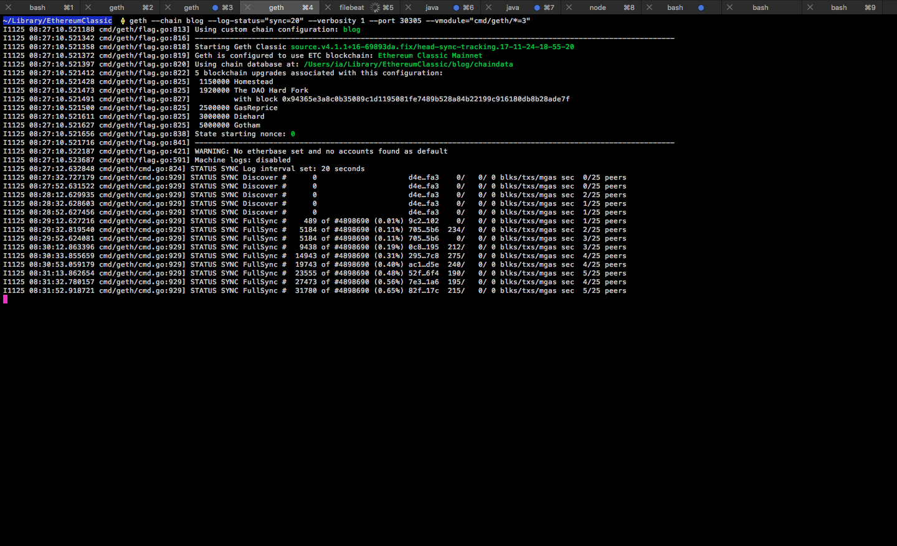
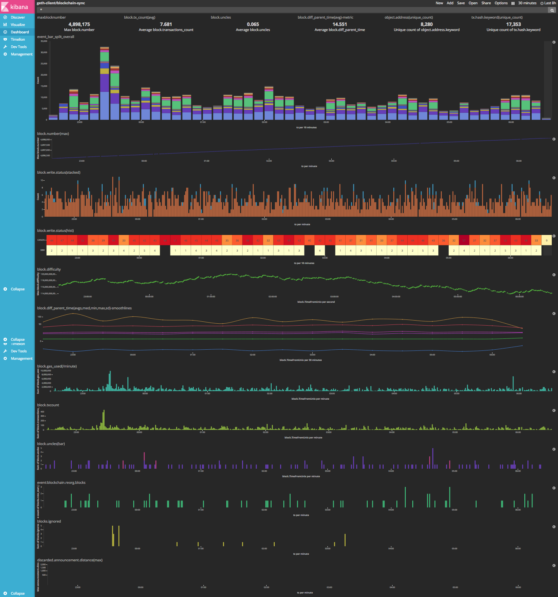
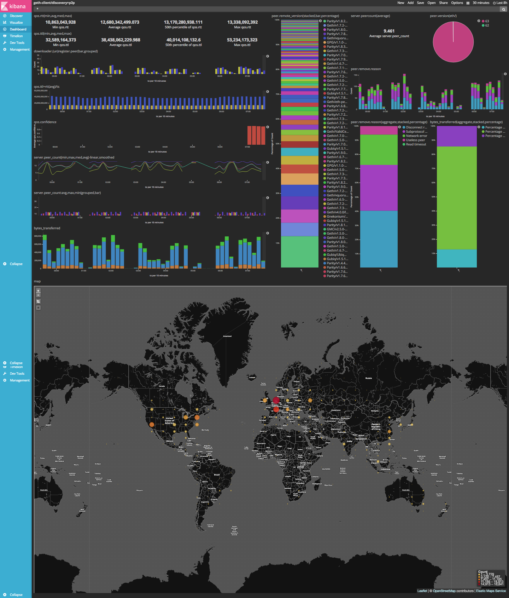
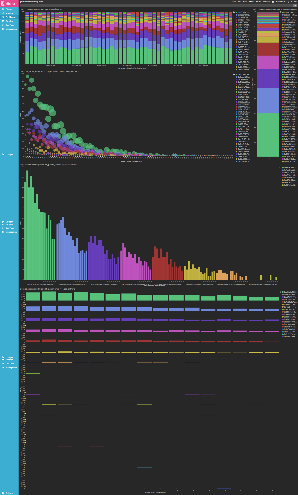

# MLog Blog

> Please note that this document that the geth `mlog` APIs referenced herein are still (as of 24 Nov 2017) in an experimental stage and should not be relied on for production purposes.

- [Ethereum Classic](https://ethereumclassic.github.io/)
- Elastic's [(Filebeat)-Elasticsearch-Logstash-Kibana (_ELK_)](https://www.elastic.co/products)

If you're running [Geth classic](https://github.com/ethereumproject/go-ethereum) you're likely to see some console logs something like this:

```
$ geth --vmodule="eth/fetcher/*=6,eth/downloader/*=6,eth/peer.go=6,eth/handler.go=5,core/database_util.go=6,core/blockchain.go=6" --log-dir="mainnet/log" --log-status="sync=10" --rpc --ws
```



These are logs whose style and intent trace back to, well, _traces_, debugging, developer feedback, and event updates. While useful for developers to track and understand program decision making on a micro level, when _you_ see thousands of lines like these flying across your screen, it can be not a little tricky to make sense of the "big picture" and general performance of your node.

One option for a simpler and more easily grokable output would be to use a few flags. Here we can enable sync status logs to print every 20 seconds, and turn down normal event reporting to just show errors (`1`).

```
$ geth --log-status="sync=20" --verbosity 1
```



While in some cases this might fit the bill, it also has it's own shortcomings: hard to debug, single-dimensioned, exclusively macro-level, and any performance analysis will require a calculator.

This is where geth's [mlog API](https://github.com/ethereumproject/go-ethereum/wiki/mlog-API) comes in. `MLog` stands for "machine log," and it's job is to make logs that computers can read and readily analyse. Sometimes these are also called _structured logs_.

Once you tell geth to start churning out mlogs, you can then fire them over to the Elastic stack, and open the door to something like this:

#### Blockchain & Sync:


#### Network & Peers:


#### Miners & Mining:


----

Mlog has 3 output modes (or _structures_): `plain`, `kv (key-value)`, and `json`.

Example `kv` line:
```
2017-08-24T17:17:39Z [discover] PING HANDLE FROM from.udp_address=$STRING from.id=$STRING ping.bytes_transferred=$INT
```


Example `json` line:
```
{"event":"ping.handle.from","from.id":"string","from.udp_address":"string","ping.bytes_transferred":0,"ts":"2017-10-18T09:01:06.54592753-07:00"}
```

In this walkthrough I'm going to be using the `json` mode because I've found that it saves a lot of time in configuring some of the ELK line parsers (_eg_ `grok`), indexes, and stuff.


### Big picture

Once we get geth's `mlog`s up and running, we're going to point __Filebeat__ at them to watch, read, and send off to __Logstash__. Once Logstash hears about some incoming logs from Filebeat, Logstash will parse and transform those raw logs into a structured data format for __Elasticsearch__. Elasticsearch then does a bunch of indexing and stuff and fires up a port to be able to talk to __Kibana__ about that data. Kibana is the application that provides a nice UI to interact with Elasticsearch data; build visualizations, make searches and filters... etc.

It's kind of a long ass pipeline, but the team at Elastic have done a great job of making modular software that, while it seems kind of long and complicated, offers a lot of flexibility because of the modularity; you can run Filebeat on one server next to your geth, then pipe those logs along to Logstash and Elasticsearch on another server (or two); separate your concerns, user privileges, and public APIs. Weird but great.

Be advised: we're going to run __each of these tools__ in their own terminal console. You're going to have 5 terminals open by the end of this. There are probably ways to use services, screens, backgrounding, etc. to keep your tab count smaller, but that's for another time.

### Install all the things

OSX:
```
$ brew install ethereumproject/classic/geth
$ brew install filebeat logstash elasticsearch kibana
```

If you're on Linux or Windows, you're on your own for the (F)ELK stack. You can install geth
by checking out our [Releases Page](https://github.com/ethereumproject/go-ethereum/releases) and just downloading the (archived) binary, un-archiving the executable, and moving it to your `$PATH`.


### Get geth going

##### Terminal 1

So far for geth `mlog` is disabled by default; you'll need to turn it on as you fire up your geth instance.

```
$ geth --mlog=json
```

In this walkthrough I'm only going to use the `json` format for mlogs. You can also use
`kv`, or `plain`. I like JSON because Logstash likes JSON, so it saves a lot of [`grok`ing](https://www.elastic.co/guide/en/logstash/current/plugins-filters-grok.html).

You can also use `--mlog-dir=place/for/mlogs [default: <datadir>/<chaindir>/mlogs]` to pick where you want to keep these logs. Be advised that these logs aren't tiny. Geth will generate about 200MB of machine logs every 12 hours. If you're only interested in mlogs for certain components, you can also use the `--mlog-components` flag. As usual, check out `geth help` for a little more information there.

#####  You get out what you put in.
Elasticsearch is going to ingest and store the data it gets from geth. This means that Elasticsearch
_will only have_ the data that you mlog from geth until you run it with mlog tomorrow... and so on. If you've only used `--mlog` with geth today, that's all the data Elasticsearch is going to get. It won't automatically have lifetime of data for your geth client or somehow magically know about the whole blockchain.


### Filebeat, Logstash, Elasticsearch

##### Terminal 2

> Filebeat config: [./filebeat.geth.mlog.json.yml](./filebeat.geth.mlog.json.yml)
```
filebeat.prospectors:
- input_type: log
  paths:
    - /Users/ia/Library/EthereumClassic/mainnet/mlogs/geth*
  symlinks: true
  json.message_key: event
  json.keys_under_root: true
output.logstash:
  hosts: ["localhost:5043"]
```

Note that we're using wildcard globbing to read all `mlog*` files. Geth will create a new mlog file each time it fires up, and automatically roll the log file when it reaches a max size. Your `mlogs/` may well end up looking like

```
-rw-r--r-- 1 ia staff 3.8M Nov 21 11:43 geth.mh.ia.mlog.20171121-114144.51125
-rw-r--r-- 1 ia staff  53M Nov 21 16:54 geth.mh.ia.mlog.20171121-114910.52716
-rw-r--r-- 1 ia staff  40M Nov 21 20:35 geth.mh.ia.mlog.20171121-165414.8245
-rw-r--r-- 1 ia staff 112M Nov 22 10:43 geth.mh.ia.mlog.20171121-223130.69466
-rw-r--r-- 1 ia staff 183M Nov 23 10:55 geth.mh.ia.mlog.20171122-213235.3464
-rw-r--r-- 1 ia staff 3.5M Nov 23 10:55 geth.mh.ia.mlog.20171123-105520.37157
-rw-r--r-- 1 ia staff 6.2M Nov 23 11:06 geth.mh.ia.mlog.20171123-105957.38013
-rw-r--r-- 1 ia staff  14M Nov 23 12:01 geth.mh.ia.mlog.20171123-110659.39536
-rw-r--r-- 1 ia staff  18M Nov 23 13:47 geth.mh.ia.mlog.20171123-120155.50707
-rw-r--r-- 1 ia staff 3.7M Nov 23 13:48 geth.mh.ia.mlog.20171123-134731.70141
-rw-r--r-- 1 ia staff  40M Nov 23 19:27 geth.mh.ia.mlog.20171123-135124.71278
```

so it's a nice feature for Filebeat to provide.

Turn Filebeat on:

```
$ filebeat -e -c $(pwd|echo path/to/this/dir)/filebeat.geth.mlog.json.yml -d "publish"
```

The point is you want to use _this_ config file. Filebeat's default config dir is /usr/local/etc/filebeat and it comes with a default config file, so you can either toss this config in there or point to it.

Filebeat is publishing your logs on port `5043`.


----

##### Terminal 3


